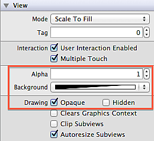

关于 UIView 的透视度，有四个属性（下图中红框中的项）都与之相关，作为一个喜欢刨根问底的程（处）序（女）员（座），一定要搞清楚它们各自的用处跟区别是什么呢？

### hidden

此属性为 BOOL 值，用来表示 UIView 是否隐藏。关于隐藏大家都知道就是让 UIView 不显示而已，但是需要注意的是：

- 当前 UIView 的所有 subview 也会被隐藏，忽略 subview 的 hidden属性。UIView 中的 subview 就相当于 UIView 的死忠小弟，老大干什么我们就跟着老大，同进同退，生死与共！
- **当前 UIView 也会从响应链中移除。**你想你都不显示了，就不用在响应链中接受事件了。

### alpha

此属性为浮点类型的值，取值范围从 0.0 到 1.0，表示从完全透明到完全不透明，其特性有：

- **当前 UIView 的 alpha 值会被其所有 subview 继承。**因此，alpha 值会影响到 UIView 跟其所有 subview。
- **alpha 具有动画效果。**当 alpha 为 0 时，跟 hidden 为 YES 时效果一样，但是 alpha 主要用于实现隐藏的动画效果，在动画块中将 hidden 设置为 YES 没有动画效果。

### backgroundColor 的 alpha（Clear Color）

此属性为 UIColor 值，而 UIColor 可以设置 alpha 的值，其特性有：

- **设置 backgroundColor 的 alpha 值只影响当前 UIView 的背景，并不会影响其所有 subview。**这点是同 alpha 的区别，Clear Color 就是 backgroundColor 的 alpha 为 1.0。
- **alpha 值会影响 backgroundColor 最终的 alpha。**假设 UIView 的 alpha 为 0.5，backgroundColor 的 alpha 为 0.5，那么 backgroundColor 最终的 alpha 为 0.25(0.5 乘以 0.5)。

### opaque

此属性为 BOOL 值。要搞清楚这个属性的作用，就要先了解绘图系统的一些原理：屏幕上的每个像素点都是通过 RGBA 值（Red、Green、Blue 三原色再配上 Alpha 透明度）表示的，当纹理（UIView 在绘图系统中对应的表示项）出现重叠时，GPU 会按照下面的公式计算重叠部分的像素（这就是所谓的“合成”）：

> Result = Source + Destination * (1 - SourceAlpha)

Result 是结果 RGB 值，Source 为处在重叠顶部纹理的 RGB 值，Destination 为处在重叠底部纹理的 RGB 值。通过公式发现：当 SourceAlpha 为 1 时，绘图系统认为下面的纹理全部被遮盖住了，Result 等于 Source，直接省去了计算！尤其在重叠的层数比较多的时候，完全不同考虑底下有多少层，直接用当前层的数据显示即可，这样大大节省了 GPU 的工作量，提高了效率。（多像现在一些“美化墙”，不管后面的环境多破烂，“美化墙”直接遮盖住了，什么都看不到，不用整治改进，省心省力）。更详细的可以读下 objc.io 中[<绘制像素到屏幕上>](http://objccn.io/issue-3-1/)这篇文章。

那什么时候 SourceAlpha 为 1 呢？这时候就是 opaque 上场的时候啦！当 opaque 为 YES 时，SourceAlpha 为 1。opaque 就是绘图系统向 UIView 开放的一个性能开关，开发者根据当前 UIView 的情况（这些是绘图系统不知道的，所以绘图系统也无法优化），将 opaque 设置为 YES，绘图系统会根据此值进行优化。所以，如果在开发时某 UIView 是不透明的，就将 opaque 设置为 YES，能优化显示效率。

需要注意的是：

1. 当 UIView 的 opaque 为 YES 时，其 alpha 必须为 1.0，这样才符合 opaque 为 YES 的场景。如果 alpha 不为 1.0，最终的结果将是不可预料的（unpredictable）。
2. opaque 只对 UIView 及其 subclass 生效，对系统提供的类（像UIButton，UILabel）是没有效果的。

## 参考

- [UIView: opaque vs. alpha vs. opacity](http://stackoverflow.com/questions/8520434/uiview-opaque-vs-alpha-vs-opacity)
- [UIView alpha vs. UIColor alpha](http://stackoverflow.com/questions/20423390/uiview-alpha-vs-uicolor-alpha)
- [UIView的alpha、hidden和opaque属性之间的关系和区别](http://blog.csdn.net/wzzvictory/article/details/10076323)
- [绘制像素到屏幕上](http://objccn.io/issue-3-1/)

