## 背景

Modern Web Browser 的架构趋势是[多进程 Process Per Tab](https://helgeklein.com/blog/modern-multi-process-browser-architecture/)，例如 Chromium（Chrome 或 Edge） 中，每一个 Tab 都对应一个子进程，Safari 虽然不是 Chromium，也是类似的表现。随着 Web Browser 和 Web 技术的发展，越来越多的服务通过 SaaS 或 WebApp 的形式提供，例如 Confluence、Figma 等，Web Browser 逐渐成为日常工作中重度使用的平台和资源占用大户。现在的一些监控服务虽然能获取各个进程的 CPU/Memory Usage，但是无法监测到到底是哪个 Tab 或 WebApp 耗费的资源比较多，无法更细化的分析 Web Browser 性能。因此，更细化的监控 Web Browser 的性能是个痛点与需求。

Chrome 和 Edge 虽然提供了 Task Manager，可以显示其各个子进程的类型，Tab 当前的 URL，以及其 CPU、Memory 等性能数据，但是很多系统后台性能监控服务无法像用户一样直接打开 OS 内置的 Activity Monitor 等软件查看数据，需要自己通过 API 来获取，因此，我们也需要一种能够在浏览器外部获取每个 Tab 的性能数据，并且要知道对应的 URL 是什么，这样才能方便的定位出到底是哪些 Web App 导致 Browser 消耗了大量性能。

## Chrome 技术调研
### Chrome Extension API: chrome.processes
首先想到了是 Chrome Extension 是否提供了相关 API 可以获取 Tab 的性能数据：
[chrome.tabs](https://developer.chrome.com/docs/extensions/reference/api/tabs) 能够访问 Chrome 的 Tab 信息，但其 tabId 是 Chrome 内部使用的，与 pid 没有关系。
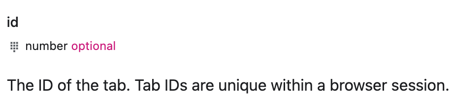

后来看到了 [chrome.processes](https://developer.chrome.com/docs/extensions/reference/api/processes)，能够通过 tabId 获取对应 Process 的信息，包括 CPU、Memory、pid 等，但遗憾的是，该 API 只能在 Dev Channel 的 Chrome 下执行，正常用户使用的 Stable Channel 的 Chrome 是无法调用此 API 的。
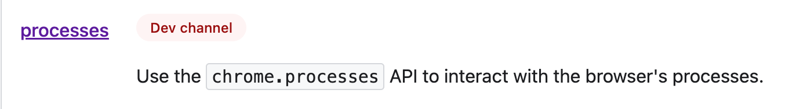

看到 2017 年 Chrome 论坛也有人问：https://groups.google.com/a/chromium.org/g/chromium-extensions/c/pyAzuN4neHc ，于是试试有没有什么 Hack 的方式可以访问 [_permission_features.json](https://chromium.googlesource.com/chromium/src/+/main/chrome/common/extensions/api/_permission_features.json)，从而修改权限，后来发现该文件是 Chrome 编译时候的选项，相当于 Channel 是编译期决议，因此这条路走不通。

### Chrome DevTools Protocol
Extension 的路走不通，搜索过程中看到了 [Chrome DevTools Protocol](https://chromedevtools.github.io/devtools-protocol/)，是 Chrome 对外开放的一个“远程”调试接口，那通过此接口，能否读取 Chrome 的内部信息呢？读了读文档之后，找到一个 SystemInfo 接口 [Chrome DevTools Protocol - SystemInfo domain](https://chromedevtools.github.io/devtools-protocol/tot/SystemInfo/)。

但是也不行，原因是：
1. 使用 Chrome DevTools Protocol 需要在启动 Chrome 时，配置 `--remote-debug-port=xxx` 的参数，用于启动一个 WebSocket 供外部连接，这对于开放调试或者开发者而言还行，对用户来说太不透明。
2. SystemInfo 中返回的 Process 数据内容太少，虽然有 pid，但是没有 pid 与 Tab 的映射，无法通过 pid 获取 Tab 的信息。


### 逆向 Chrome 内部 IPC 接口
在搜索 “Get Chrome tab pid” 的过程中，看到回答基本都是使用 Chrome 自带的 Task Manager，提供了每个 Tab 对应的 CPU、Memory、Network、pid 等数据：
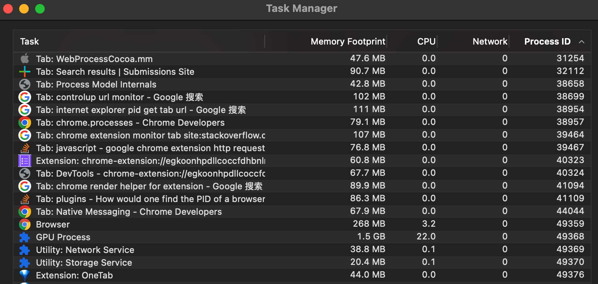

而 Chrome 是多进程架构，进程之间通过 [Mojo](https://chromium.googlesource.com/chromium/src/+/master/mojo/README.md) 进行通信，而 Mojo 比较像 RPC，上层在使用时就如同调用其他进程的 API 一样。而 Chromium 是开源的，能够搜索到 Task Manager 的[源码](https://source.chromium.org/chromium/chromium/src/+/main:chrome/browser/task_manager/task_manager_interface.h)，能否通过模拟 Mojo 的调用，读取 Task Manager 中的数据呢？

首先需要分析一下 Mojo 的数据格式，看到了 [Breaking The Browser - A tale of IPC, credentials and backdoors - MDSec](https://www.mdsec.co.uk/2021/01/breaking-the-browser-a-tale-of-ipc-credentials-and-backdoors/) 和 [Attacking Chrome IPC](https://www.youtube.com/watch?v=39yPeiY808w)，并尝试使用文中使用的 Chrome IPC Sniffer 在 Windows 上进行分析：

刚开始但发现 mojo 的解析失效了，Wireshark 无法分析出来最顶层 mojo 的数据包，导致无法看到 mojo 的具体数据结构：
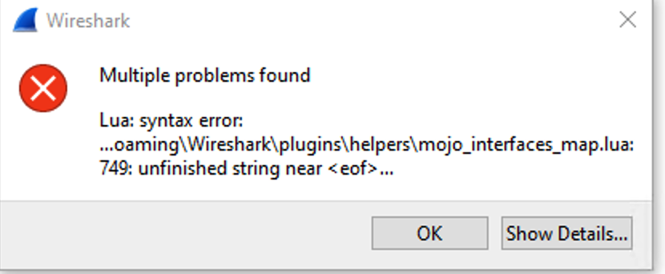
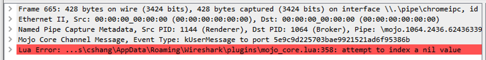
后来对比了出问题的 lua 文件和 Github 上对应文件，发现在解压时，sniffer 的 lua 插件中文件内容不全，像是解压问题，再次解压后能够读取数据了。

但 mojo 是 Chrome 内部使用的，不稳定，即使这次能够通过逆向 IPC 接口拿到 Task Manager 数据，可一旦 mojo 协议和 Task Manager 相关接口发生变化，就失效了，而且不确定 IPC 调用时未定义的行为会不会导致 Chrome 崩溃。

### 慢慢确定思路
到这里仿佛没有路了，在不断搜索中，看到了这个回答：https://stackoverflow.com/questions/63000671/how-would-one-find-the-pid-of-a-browser-extension-running， `ps -ax | grep 'Google Chrome Helper' | grep "extension-process"` ，是通过分析每个 Chrome 子进程的名字和启动命令行参数得到哪个是 Extension 的，这给我打开了思路，开始仔细分析 ps 出来的 Chrome 子进程的信息：
> 63554 ??         0:25.20 /Applications/Google Chrome.app/Contents/Frameworks/Google Chrome Framework.framework/Versions/107.0.5304.87/Helpers/Google Chrome Helper (Renderer).app/Contents/MacOS/Google Chrome Helper (Renderer) --type=renderer --display-capture-permissions-policy-allowed --lang=en-US --num-raster-threads=4 --enable-zero-copy --enable-gpu-memory-buffer-compositor-resources --enable-main-frame-before-activation --renderer-client-id=236 --time-ticks-at-unix-epoch=-1666552889280259 --launch-time-ticks=817765184167 --shared-files --field-trial-handle=1718379636,r,13433701468379812598,11346460162339610094,131072 --seatbelt-client=204

分析的规律如下：
* 对于不同类型的进程，Chrome 启动的程序不一样，可以分析出来 Chrome 子进程的类型。
  * Tab 和 Extension 是 Google Chrome Helper (Renderer)，type 为 renderer，Extension 会多一个 `--extension-process` 的参数。
  * GPU 是 Google Chrome Helper (GPU)。
  * Utility 是 Google Chrome Helper，type 为 renderer，会有一个 `--utility-sub-type` 指定 Utility 的具体功能。
  * `chrome_crashpad_handler` 用于监控 Chrome 的崩溃。
* 对于 Tab，其启动参数中大部分是相同的，有一个比较特殊，叫 `--renderer-client-id`，我发现这个 id 每个 Tab 都是唯一的。

于是想到一种思路：**通过 ps 能获取到 pid 与 renderer-client-id 的关系，那能否从 Chrome 中拿到 renderer-client-id  与 Tab 的映射关系呢？** 这样的话，Browser 的监控思路就是：
* 通过一定方式，获取 Tab 与 renderer-client-id 的映射，并将 Tab 对应的 URL 发送给 Native 程序。
* Native 程序在做进程的性能监控时，对于 Chrome，分析 renderer-client-id 与 pid 映射，通过两者结合，将 URL 与进程的性能信息进行绑定。

那如何获取 Tab 与 renderer-client-id 的映射？是下一步的攻关难点。

### 解析 Chrome Session File（SNSS）
Chrome 存在一个 Session File SNSS，当 Chrome 被意外关闭时，可以通过访问该文件恢复所有的 Tab。尝试从这里读取 Tab 信息，但问题是：
1. SNSS 并不是文本文件，需要一个解析器，目前并没有什么稳定的解析器，解析器都是通过逆向写的。
2. 另外，这里只有 URL，没有 Tab 到 pid 的映射。

### AppleScript 调用 Chrome 接口
使用 [AppleScript 调用 Chrome 提供的接口](https://github.com/prasmussen/chrome-cli)，不行，列出的 Tab 中 tabId 是内部 ID，和 pid 无法映射。

### 基于 chrome://process-internals
Chrome 内置了一些 Scheme 为 chrome 的 URL，通过 chrome://chrome-urls/ 可以查看，其他浏览器见[这里](https://www.stefanjudis.com/today-i-learned/how-to-find-all-internal-pages-in-chromiums-and-firefox/)，在一个个打开的过程中，发现了 chrome://process-internals，该页面显示所有 Tab 与 Extension 的 FrameTrees：

经过分析，发现 Frame 中第一个数字就是 renderer-client-id，可以通过解析此页面的结果，反查 pid 对应的 URL。但问题是如何在用户无感知的情况下解析获取这个页面的数据呢？

第一个尝试是使用 Chrome 的 [headless 模式](https://developer.chrome.com/blog/headless-chrome/) ，可以无 UI 的使用 Chrome。但一旦 Chrome 启动，无法再次启动一个 Chrome 进程（注意不是窗口），每次调用 Chrome 的二进制都会触发一个新窗口，而使用 headless 相当于和原来的 Chrome 进程互相隔离，是无法通过访问 headless 的 Chrome 获取用户正在使用的 Chrome 的数据的。

第二个尝试是将 chrome://process-internals 页面的源码 Load 下来，在本地加载，避免解析 HTML 页面。在将相关 JS 代码下载后，在 binding.js 中找不到 Mojo 的定义，经过搜索 Chrome 源码，Mojo 是一个全局变量，无法在本地下载的情况下使用：
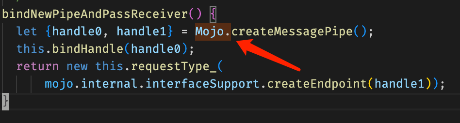

### 再次回到 Chrome Extension API: chrome.webNavigation
再次绝望，直到搜到了 [Get Chrome tab pid from Chrome extension - Stack Overflow](https://stackoverflow.com/questions/36834312/get-chrome-tab-pid-from-chrome-extension)，里面发现 [chrome.webNavigation](https://developer.chrome.com/docs/extensions/reference/webNavigation/) 可以返回当前 Tab 最顶层 Frame（frameId 为 0）的 processId，而经过对比，发现这个 processId 正是 renderer-client-id！
折腾了这么久，终于找到了解决方案：实现一个 Chrome Extension，通过 chrome.tabs 接口遍历所有的 Tab，拿到 tabId 和 URL，再通过 chrome.webNavigation + tabId 获取到 renderer-client-id。


### 确定方案稳定性
这个方案虽然可行，且比较 tricky，但是否稳定？让 Chromium 源码为我们证明。

#### renderer-client-id
启动参数中的 `render-client-id`（[源码](https://source.chromium.org/chromium/chromium/src/+/main:content/public/common/content_switches.cc?q=renderer-client-id&ss=chromium)），2016 年被加入，赋值给 kRendererClientId。

kRendererClientId 在 `render-process-host-impl.cc` 中使用，AppendRendererCommandLine 将 RenderProcessHostImpl 的 ID 设置为 kRendererClientId（[源码](https://source.chromium.org/chromium/chromium/src/+/main:content/browser/renderer_host/render_process_host_impl.cc;l=3271;drc=ceb5f7a570260bf7d588af1c7f049334681f7fdb;bpv=1;bpt=1)）：
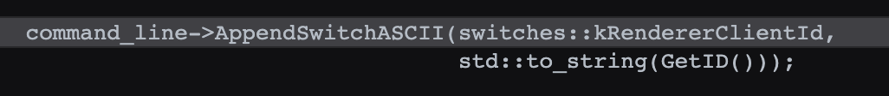

RenderProcessHostImpl 负责创建和管理渲染子进程，其成员变量 ID 是通过 `ChildProcessHostImpl::GenerateChildProcessUniqueId()` 生成（[源码](https://source.chromium.org/chromium/chromium/src/+/main:content/browser/renderer_host/render_process_host_impl.cc?q=GenerateChildProcessUniqueId&ss=chromium)）：
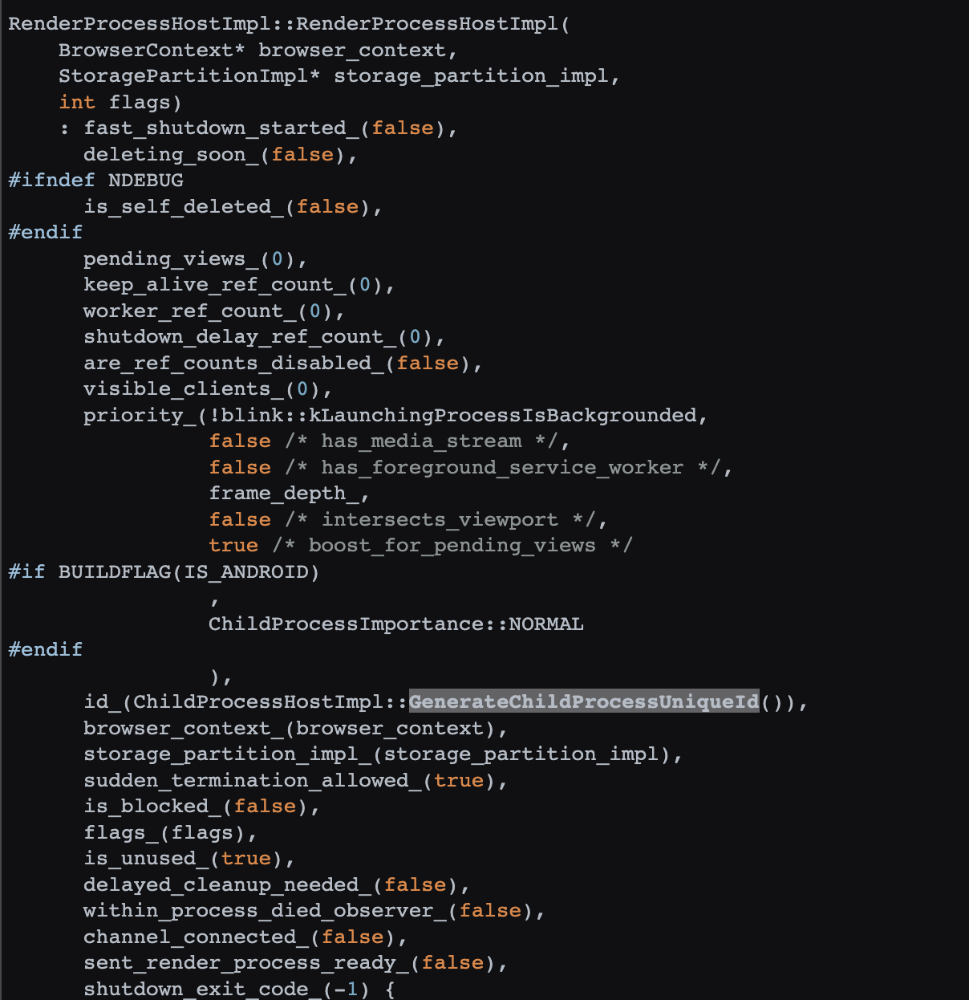


RenderProcessHostImpl 的 Init 会负责启动一个渲染子进程，通过 `ChildProcessHost::GetChildPath(flags)` 获取 Google Chrome Helper 对应的路径（[源码](https://source.chromium.org/chromium/chromium/src/+/main:content/common/child_process_host_impl.cc;drc=ceb5f7a570260bf7d588af1c7f049334681f7fdb;l=67))，例如 Render 类型会加 Render 后缀，GPU 类型会加 GPU 后缀。

#### frame.processId
对于 frame 中的 processId，通过[源码](https://source.chromium.org/chromium/chromium/src/+/main:out/Debug/gen/content/browser/resources/process/tsc/process_internals.mojom-webui.js?q=processId&ss=chromium&start=41)可以看到，JS binding 调用的是 ProcessInternalsHandler 中的 `frame_info->process_id = frame->GetProcess()->GetID();`。其中 frame 为 RenderFrameHostImpl，其 GetProcess 返回的是 RenderProcessHost，实际上由 `agent_scheduling_group_` 返回：
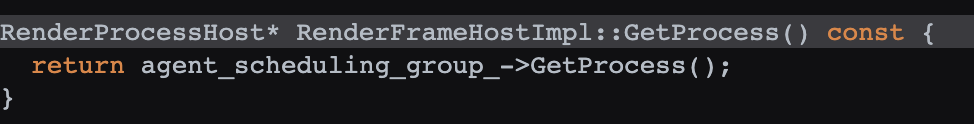

AgentSchedulingGroupHost 在 GetOrCreate 中创建（[源码](
https://source.chromium.org/chromium/chromium/src/+/main:content/browser/renderer_host/agent_scheduling_group_host.cc;l=104;drc=ceb5f7a570260bf7d588af1c7f049334681f7fdb;bpv=1;bpt=1)）：
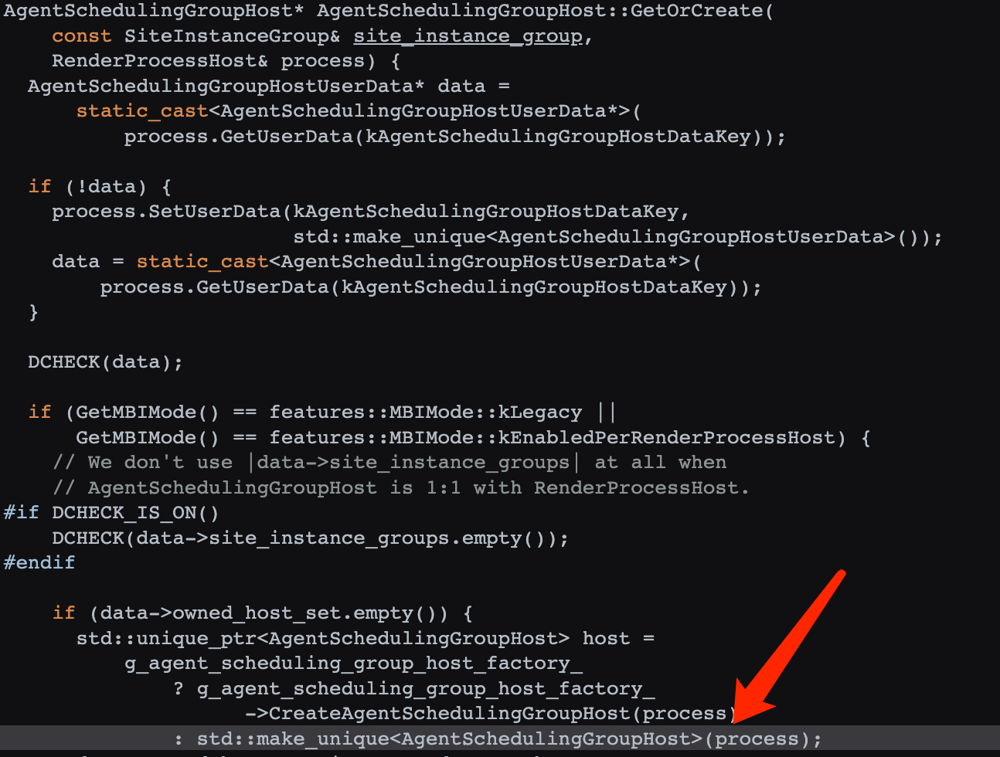

AgentSchedulingGroupHost 的 GetOrCreate 被 SiteInstanceGroup 调用（[源码](https://source.chromium.org/chromium/chromium/src/+/main:content/browser/site_instance_group.cc;l=24;drc=ceb5f7a570260bf7d588af1c7f049334681f7fdb;bpv=1;bpt=1)）：
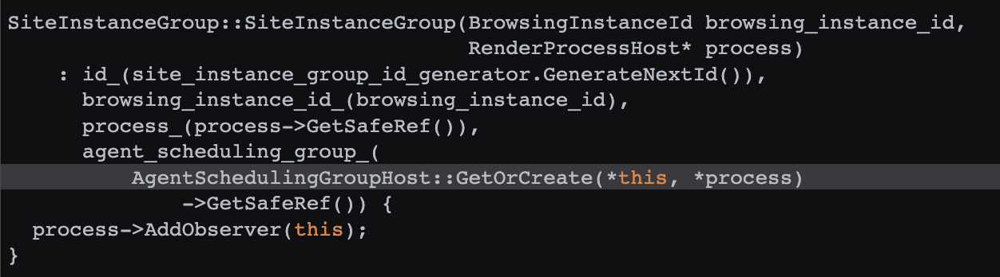

SiteInstanceGroup 在 SiteInstanceGroupManager 的 GetOrCreateGroupForNewSiteInstance 中调用（[源码](https://source.chromium.org/chromium/chromium/src/+/main:content/browser/site_instance_group_manager.cc;l=49;drc=ceb5f7a570260bf7d588af1c7f049334681f7fdb;bpv=1;bpt=1)）：
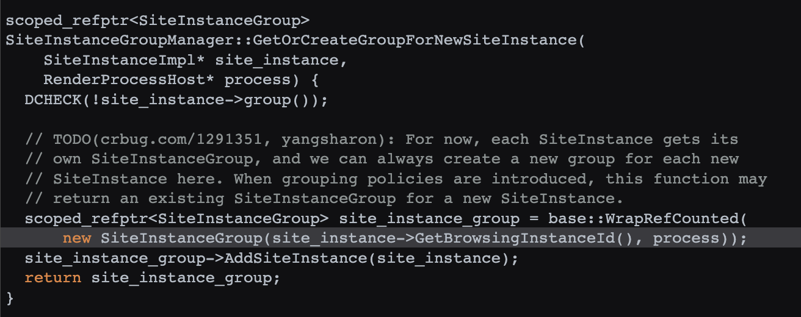

而 GetOrCreateGroupForNewSiteInstance 最终在 SiteInstanceImpl 的 SetProcessInternal 中调用（[源码](https://source.chromium.org/chromium/chromium/src/+/main:content/browser/site_instance_impl.cc;l=413;drc=ceb5f7a570260bf7d588af1c7f049334681f7fdb;bpv=1;bpt=1)）：
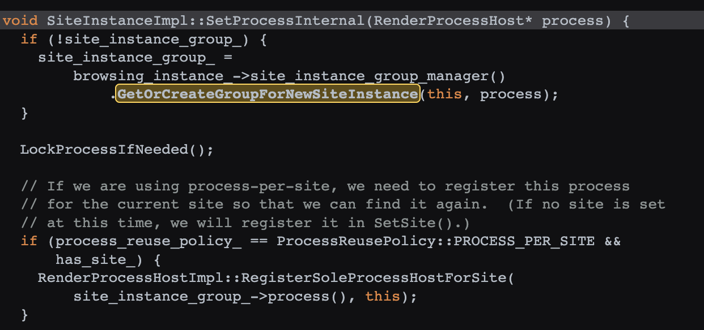

而 SetProcessInternal 的 process 参数是 RenderProcessHostImpl 的 GetProcessHostForSiteInstance（[源码](https://source.chromium.org/chromium/chromium/src/+/main:content/browser/site_instance_impl.cc;l=375;drc=ceb5f7a570260bf7d588af1c7f049334681f7fdb;bpv=1;bpt=1)）：
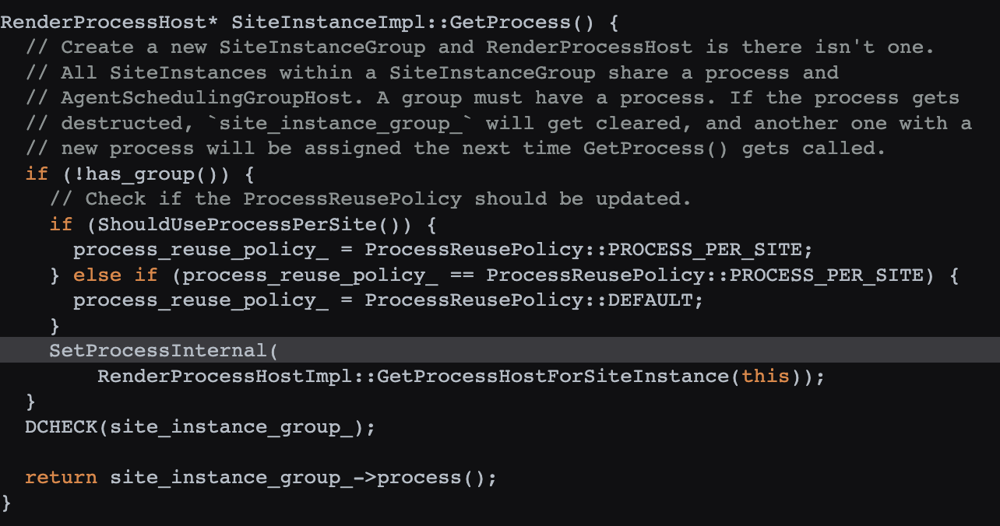

兜兜转转，又回到了 RenderProcessHostImpl，因此数据流就通了：
1. RenderProcessHostImpl 负责创建一个渲染子进程，通过 GenerateChildProcessUniqueId 生成一个 ID，并配置到其启动程序的 renderer-client-id 上。
2. 同时 FrameInstance 会绑定一个 RenderProcessHostImpl，其 ID 就是 ProcessId。

数据流比较稳定：renderer-client-id 从 16 年就有了，一直没变过，frame 的 processId 从 14 年就基于 RenderProcessHostImpl 的 GenerateChildProcessUniqueId 了。

### Edge
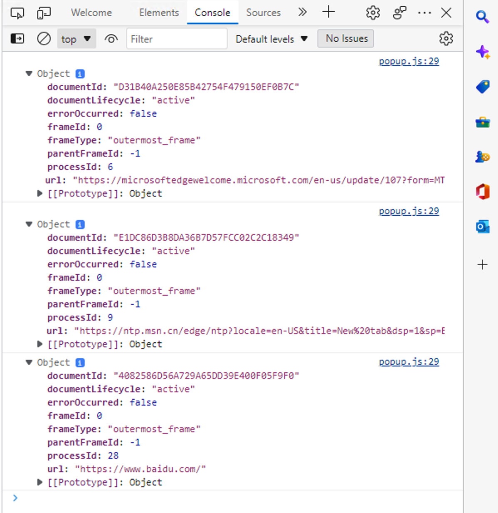

解决了 Chrome，由于 Edge 同样基于 Chromium，因此 Edge 可以直接加载 Chrome 的 Extension，另外，Edge 每个 Tab 的子进程的启动参数中也有 renderer-client-id，所以，Edge 的方案与 Chrome 基本一致：
* Edge 的子进程前缀是 Microsoft Edge。
* Edge 会有 PrerenderTab，在启动参数中含有  `--instant-process`。


确定了整体方案，还需要验证：
1. 能否通过代码方式，获取一个 pid 对应进程的命令行启动参数。
2. Extension 如何与 Native App 进行通信。

### 获取 Process 的命令行参数
对于 Windows，参考：[How to query a running process for its parameters list? (Windows, C++)](https://stackoverflow.com/questions/6520428/how-to-query-a-running-process-for-its-parameters-list-windows-c/6522047) 和 [c - How can I get the full command line of all the processes after doing a process walk of the snapshot? - Stack Overflow](https://stackoverflow.com/questions/21945606/how-can-i-get-the-full-command-line-of-all-the-processes-after-doing-a-process-w)，效果如下：
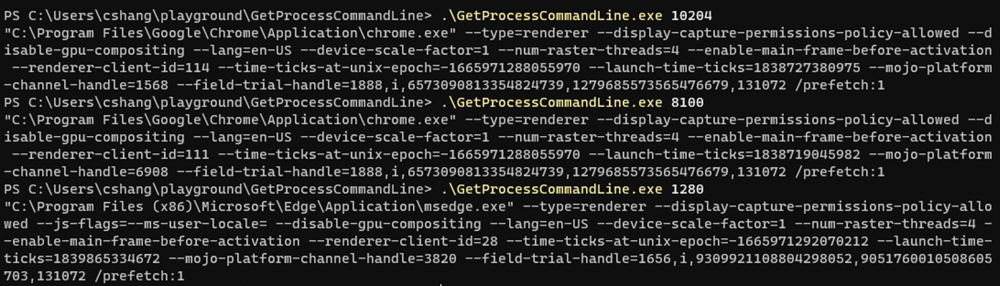

对于 Mac，参考 [Chromium 源码中的 process_info_mac.cc](https://chromium.googlesource.com/crashpad/crashpad/+/refs/heads/master/util/posix/process_info_mac.cc)，效果如下：
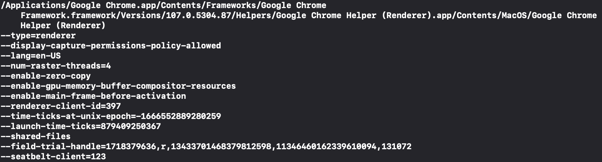

### Extension 同 Native App 通信
搜了一些文章
* [Web-to-App Communication: The Native Messaging API – text/plain](https://textslashplain.com/2020/09/04/web-to-app-communication-the-native-messaging-api/)
* [Browser Architecture: Web-to-App Communication Overview – text/plain](https://textslashplain.com/2019/08/28/browser-architecture-web-to-app-communication-overview/)
* https://learning.postman.com/docs/sending-requests/capturing-request-data/interceptor/

主流就是两种思路：一个是通过 WebSocket，一个是基于 Chrome 提供的 Native Messaging
* WebSocket 的问题在于在 Extension 中是否有权限可以访问一个 WebSocket 服务器，且这个服务器是否要求必须是 wss，本地服务器的 ssl 证书不太好弄，另外安全性上风险也高一些。
* Native Messaging 看起来更合适一些，因为需求中数据传输量并不大，而且相对安全性好。

## Native Messaging 技术调研
在调试 Native Messaging 过程中发现以下问题：
1. Host 端不能使用任何 cout 输出，否则调试不通。如果要调试，只能输出到 cerr。
2. Host 端是由 Chrome 启动的，自己启动没有用，Chrome 只与自己启动的那一份进程通信。
3. manifest 中 name 必须为 小写字母 . 和 _，其他均为非法。
4. manifest 应该放到 `~/Library/Application Support/Google/Chrome/NativeMessagingHosts` 目录。
5. manifest 的名字应该与 name 一致，为 name.json。

因此，Native Service 不适合作为 Extension 的 NativeMessagingHost，需要想办法，有两种方式：
1. Extension 通过 WebSocket 连接到 NativeService。
2. Extension 与 NativeService 实现一个 Proxy，用于 Extension 调用并中转消息。

对于 1，问题是：
* 没有找到一个案例这样用。
* Chrome 本身对 WebSocket 的限制，例如需要使用 wss 而不是 ws。
* NativeService 配置 ssl 证书私钥感觉不安全。
* WebSocket 服务的端口号可能被占用，因此 1 不太合适。

对于 2，有以下方案：
* 使用数据库：Proxy 收到数据后写入数据库，问题是通信是单向的，Ao Zhang 的经验看，在 Windows 上使用数据库不太稳，总有各种各样问题。
* 使用 JSON 文件：Proxy 写入，NativeService 读取，问题是通信是单向的，且读写频率不好同步。
* 使用进程间通信（Windows 是 Named Pipe，Mac 是 Unix Domain Socket）：成熟的方案，双向通信，比较稳妥。

基于此，架构改变为：**增加一个 Extension Helper 作为 Proxy，负责接收 Extension 的数据，通过 IPC 接口转发给 Native Service**。

参考：
* https://developer.chrome.com/docs/extensions/reference/runtime/#method-connectNative
* https://developer.chrome.com/docs/apps/nativeMessaging/
* [WebExtension with Native messaging C++ App side - Development - Mozilla Discourse](https://discourse.mozilla.org/t/webextension-with-native-messaging-c-app-side/30821)


## Safari 技术调研
Safari 不是基于 Chromium，而是基于 WebKit 内核：
1. Safari Web Extension 的 API 与 Chrome 不一样，查看其 API 文档，找到 SFSafariPage 有 [getPropertiesWithCompletionHandler(_:)](https://developer.apple.com/documentation/safariservices/sfsafaripage/1639510-getpropertieswithcompletionhandl) 方法，可以获取 Page Property，但是 [SFSafariPageProperties](https://developer.apple.com/documentation/safariservices/sfsafaripageproperties) 中只有 title 和 url，没有其他信息。
2. Safari 虽然每个 Tab 也是对应一个进程，名称为 com.apple.WebKit.WebContent，但是并没有什么启动参数。

尝试搜了 Safari Web Extension 有没有什么私有 API 可以访问，在 Apple Runtime Headers 中搜了下 [macOS/PrivateFrameworks/Safari.framework/BrowserTabPersistentState.h](https://github.com/LeoNatan/Apple-Runtime-Headers/blob/5e50ad05dfd7d7b69fc2e0e685765fc054166b3c/macOS/PrivateFrameworks/Safari.framework/BrowserTabPersistentState.h)，没有什么可以用的数据。

Safari 可以通过  `defaults write com.apple.Safari IncludeInternalDebugMenu  -bool true` 打开 Debug 模式，在选项中将 Tab 对于的 pid 显示在 Tab 标题上。

后来又仔细观察了 Activity Monitor，发现 Safari 对应 Tab 的子进程，能够显示对应 Tab 的 Host URL，于是就想到了：能不能逆向 Activity Monitor，看他到底是怎么实现的。

### 如何显示 Tab 的 URL
由于 Safari 使用的是 WebKit，每个 Tab 对应是 WebContents，在用 Hopper 加载 Activity Monitor 之后，开始针对 WebContents/WebKit 进行搜索，找到了一个可疑方法，对方法进行反汇编后，定位到一个关键函数调用`_LSCopyApplicationInformationItem` 和 `LSActivePageUserVisibleOriginsKey`：

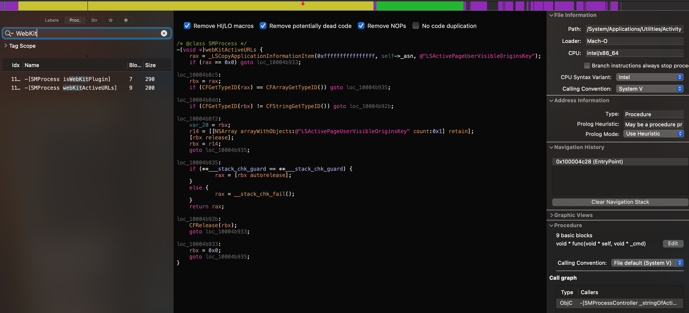

用其进行 Google 搜索，找到了以下的参考代码：
* https://gist.github.com/zorgiepoo/d751cba19a0167a589a2
* https://github.com/rodionovd/RDProcess

在配合 [WebKit 源码](https://opensource.apple.com/source/WebKit2/WebKit2-7607.2.6.1.1/WebProcess/cocoa/WebProcessCocoa.mm.auto.html)，可以看到在 WebProcess 设置名称时，会通过 `_LSSetApplicationInformationItem` 将对应名称设置为 URL。最后，自己写 Demo 验证可行性，也能像 Activity Monitor 一样显示 Tab 对应 pid 的 Host URL 了。

```objc
const CFStringRef kLSActivePageUserVisibleOriginsKey = CFSTR("LSActivePageUserVisibleOriginsKey");
const CFStringRef kLSDisplayName = CFSTR("LSDisplayName");
const int kLSMagicConstant = -2;

extern CFTypeRef _LSCopyApplicationInformationItem(int /* hopefully */, CFTypeRef, CFStringRef);
extern CFTypeRef _LSASNCreateWithPid(CFAllocatorRef, pid_t);

NSString *getWebKitActiveURL(pid_t pid) {
    NSString *url = nil;
    CFTypeRef asn = _LSASNCreateWithPid(kCFAllocatorDefault, pid);
    
    if (asn != NULL) {
        id information = CFBridgingRelease(_LSCopyApplicationInformationItem(kLSMagicConstant, asn, kLSActivePageUserVisibleOriginsKey));

        if ([information isKindOfClass:[NSString class]]) {
            url = information;
        } else if ([information isKindOfClass:[NSArray class]]) {
            NSArray *array = (NSArray *)information;
            if (array.count > 0) {
                url = array[0];
            }
        }
        
        CFRelease(asn);
    }
    
    return url;
}
```

### 如何正确的识别 Safari 的子进程
Safari 使用的 WebKit，每个 Tab 是 com.apple.WebKit.WebContent 子进程，其  ppid 都是 1（launchd），而且如果有其他 App 使用了 WebKit（WKWebView），其子进程也是 com.apple.WebKit.WebContent，使用 ppid 的话无法和  Safari 的 Tab 区分出来。需要使用私有 API  `responsibility_get_pid_responsible_for_pid`  才能取到正确的父进程，参考：[terminal - How process hierarchy works in macOS - Ask Different](https://apple.stackexchange.com/questions/327290/how-process-hierarchy-works-in-macos)。

### 如何显示 Prewarmed Tab
Safari 有 Prewarmed Tab，此 Tab 对应的进程没有 URL，但是 Activity Monitor 能显示对应进程的名称，通过 `_LSCopyApplicationInformationItem(kLSMagicConstant, asn, "LSDisplayName")`  获取进程的显示名称。

### 将现有的 Chrome Extension 转换成 Safari Extension
[Converting a web extension for Safari](https://developer.apple.com/documentation/safariservices/safari_web_extensions/converting_a_web_extension_for_safari?language=objc)
```bash
xcrun safari-web-extension-converter --app-name "ArgusSafariHelper" --bundle-identifier "com.argus.safari.helper" --macos-only --copy-resources  ../argus-chromium-extension/extension
```

 Extension 需要处理的有：
1. 删除不需要的 webNavigation 和处理权限兼容性：[Browser compatibility for manifest.json - Mozilla | MDN](https://developer.mozilla.org/en-US/docs/Mozilla/Add-ons/WebExtensions/Browser_compatibility_for_manifest.json)。
2. 处理 <all_urls> 的兼容性：[Match patterns in extension manifests - Mozilla | MDN](https://developer.mozilla.org/en-US/docs/Mozilla/Add-ons/WebExtensions/Match_patterns)。
3. 使用 browser 而不是 chrome 访问 Extension API。


## 其他 Browser 技术调研
### Internet Explorer
[c# - How to get the URL of the Internet explorer tabs with PID of each tab? - Stack Overflow](https://stackoverflow.com/questions/8445742/how-to-get-the-url-of-the-internet-explorer-tabs-with-pid-of-each-tab?rq=1)

### Firefox
Firefox 每个 Tab 对应的子进程有启动参数，也提供了 [webNavigation - Mozilla | MDN](https://developer.mozilla.org/en-US/docs/Mozilla/Add-ons/WebExtensions/API/webNavigation) 的 API，但是返回的数据中并没有 processId（文档上有），不知道为啥，[GitHub - mdn/webextensions-examples: Example Firefox add-ons created using the WebExtensions API](https://github.com/mdn/webextensions-examples#installing-an-example)

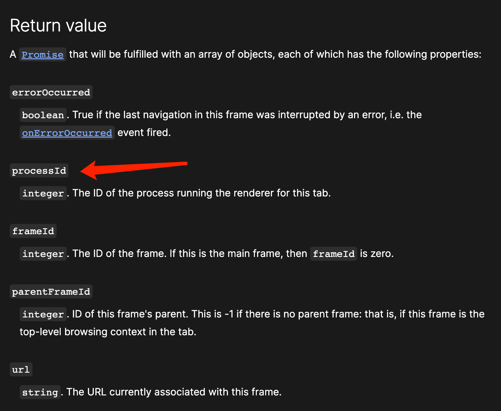

不过 Firefox 占有率不高，所以就先不看了。

## 实现

### 架构


实现需要 Web Extension + Native Service 配合才能实现，同时需要一个 “Proxy” 作为二者通信的中转站，因此架构主要由三块组成：
* Web Extension：安装在浏览器中，负责获取 Tab 的 Frame 数据和页面加载性能数据
	* 基于 Chrome Extension API，聚合多个 Event 回调，配合 content.js 中的 PerformanceObserver，生成页面加载性能数据。
	* 遍历 Tab 并通过 webNavigation 获取其 Frame 相关数据。
	* 通过 Native Messaging 与 Extension Helper 建立其连接，并接收和发送消息。
* Extension Helper：负责消息转发
	* 通过 IPC（Windows 是 Named Pipe，Mac 是 Unix Domain Socket）与 Native Service 建立通信，Native Service 是 Server 端。
	* 通过 stdin 从 Web Extension 接收消息，解码后通过 IPC 转发给 Native Service。
	* 通过 IPC 从 Native Service 接收消息，编码后通过 stdout 转发给 Web Extension。
* Native Service：负责分析监控 Browser 各个子进程及其性能数据，聚合 Web Extension 数据后上传
	* 分析各个子进程的启动参数，并通过参数来区分进程类型。
	* 监控各个子进程的 CPU 和 Memory 性能。
	* 从 Web Extension 接收消息，与进程的性能数据聚合。
	* 将页面的 CPU 和 Memory 性能以及页面加载性能上传。

最终显示效果如下：


### 实现过程中遇到的坑
#### Chromium Extension
* postMessage 发送 JSON 数据时，要使用 `{ "key": value }` 的形式，不能 `var object = {}; object.key = value`，这样会导致 NativeService 端解析 JSON 数据时失败。
* 使用 Developer Mode 加载 Extension 时，每次重新加载或者换设备都会导致 Extension 的 UUID 变化，可以利用 `manifest.json` 中的 key 来锁定 Extension 的 UUID，需要申请一个 Chrome WebStore 账号，将 Extension 的 zip 包上传一次，从而获取 PublicKey。

#### Extension Helper
* 在转发数据给 NativeService 时，先发送长度，再发送 JSON 数据。有时候 NativeService 先收到 JSON 数据，导致解析出来的 length 是一个巨大无比的值，在 recv 时越界导致崩溃。后来发现如果长度和数据分两次 send 的话，就会出现这个问题，然后 1 将 NO BLOCK 模式关了，2 将长度和数据合并到一个缓冲区中用一次 send 发送，问题不再出现。
* 发送数据给 Extension 时，必须用 JSON 包一下，否则 Extension 不识别。
* Extension Helper 由 Browser 负责启动，属于 Browser 的子进程，其生命周期和 Extension 中 `chrome.runtime.connectNative` 返回的 Port 一致，最好持有此 Port，不然每次 `chrome.runtime.connectNative` 都会创建一个 Extension Helper 子进程。

#### Native Services
* Unix Domain Socket 会新建一个文件，每次在 bind 前需要用 unlink 删除，不然会导致 bind 失败。
* 允许非 root 权限程序能够读写 Unix Domain Socket，需要在 bind 前使用 umask，然后在 bind 后恢复。
```c
int mask = umask(777);
umask(mask);
```


