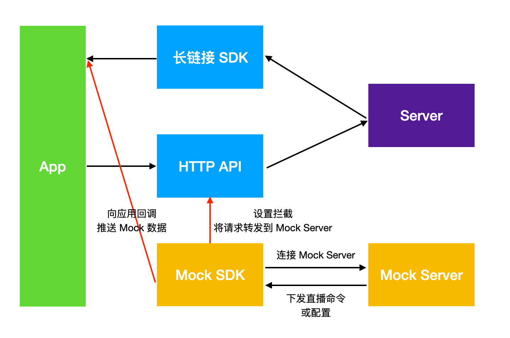
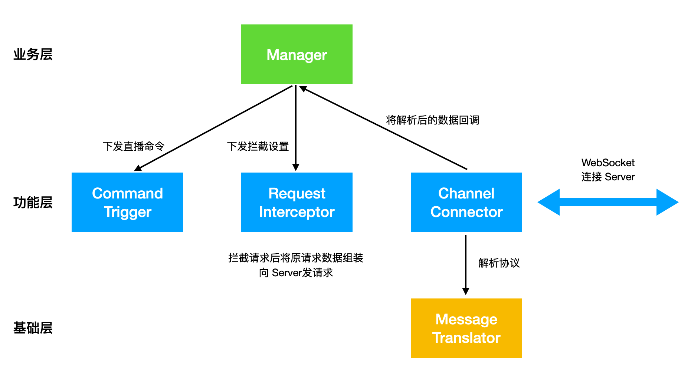
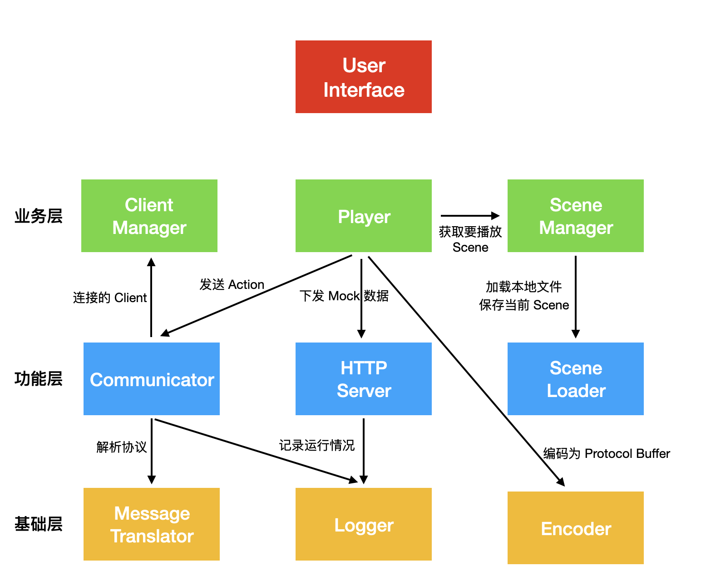
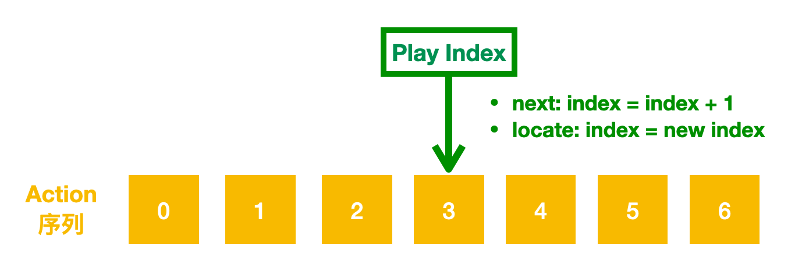
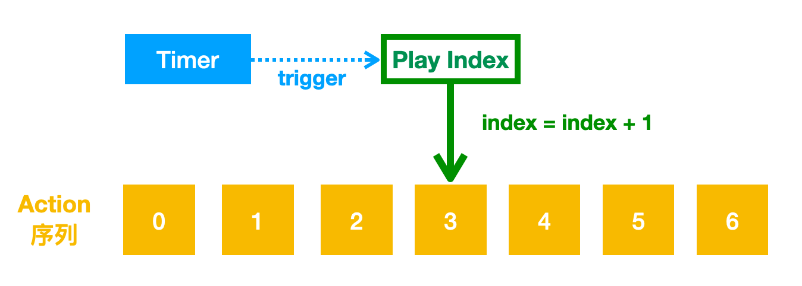
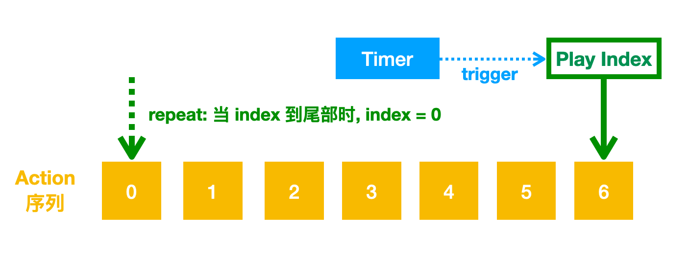
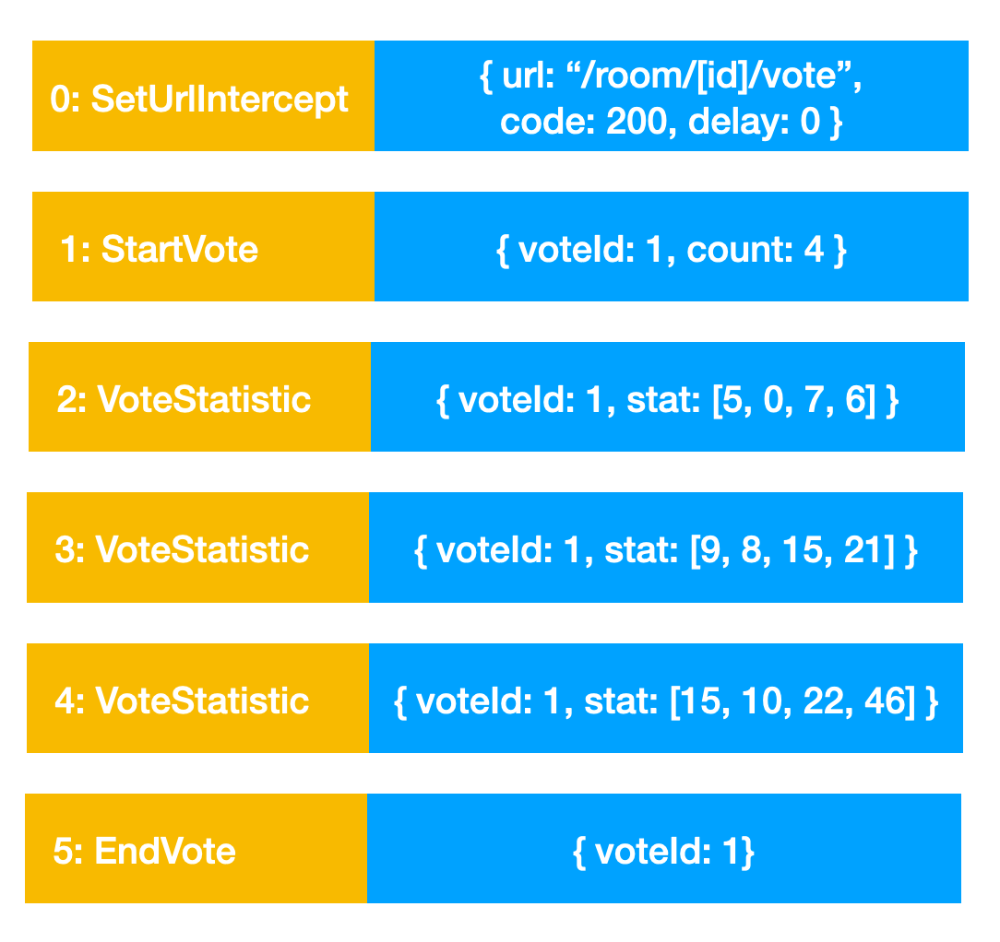

## 背景
对于客户端的 Mock 工具，你可能第一时间想到是 Charles，为什么不用 Charles 进行 Mock 呢？因为对于直播场景的编程模式，与其他通过 HTTP 请求拉取数据并渲染的模式不太一样，有如下特点：
 
* 服务器推送：在直播场景中，一般是由服务器将数据主动推送到客户端，而不是常见的由客户端发送 HTTP 请求拉取数据后渲染。推送数据的通道一般是基于 TCP 的长链接通道（也可能是 UDP），封装成 SDK 向使用方回调数据。
* 二进制数据格式：数据格式上一般为了传输性能和效率，也不是人类可读的 JSON 格式，而是机器友好的 ProtocolBuffer 或者 FlatBuffer。
* 数据获取方式并不唯一：有时为了性能，通过数据通道推送的只是一个 Trigger 命令，客户端在收到此命令后，再通过 HTTP 请求拉取数据。或者提交数据时使用的 HTTP 请求，后续的数据更新基于数据通道推送。
* 活动中会存在多个角色的交互：例如，一个活动需要在一端操作开始，另一端才能参与，参与过程中还需要不断同步状态。
* 有些活动是一次性的：一旦结束无法重新开始，需要重新配置直播间。
 
对于直播客户端的特点，在进行业务开发时会有以下痛点：
1. 无论是服务器主动推送的方式、还是构造 ProtocolBuffer 这种格式的数据，都很难进行 Mock，有时还要配合着 HTTP 请求一起 Mock。
2. 有时会依赖服务端或另外一个客户端开发完成，才能进行联调，当环境不稳定或者进度不同步时，会被 Block，联调出现问题时也不好排查。
3. 直播对性能要求较高，压测需要服务端配合，灵活性和配置性不好保证。
 
因此，直播客户端需要一个 Mock 工具，能够对基于 TCP 长链接的 Protobuf 格式直播命令和基于 HTTP 请求的 JSON 格式 API 数据都进行 Mock，从而能够提高直播客户端同学的开发与联调效率。

## 方案
在设计 Mock 系统时，涉及的问题点有：
* 如何推送 Mock 的直播命令？
* 如何拦截 HTTP 请求？
* 如何使 Mock 尽量不对业务代码造成干扰？
* 触发 Mock 数据的交互方式是什么？
* Mock 数据如何构造？有没有简便方式？

在思考这些问题点如何解决时，会发现将 Mock 逻辑放到客户端还是服务端，直接决定了问题解决方式的不同，因此有以下方案进行选择：

### 方案一：纯服务端逻辑
对于 TCP 和 HTTP 均实现一个中间层代理，代理中有一个白名单，对于匹配到白名单的项，返回 Mock 数据，对于不匹配的项，去源服务器拿数据。
优点是：对客户端透明，几乎不需要改动，需要一个开关配置是否走代理
缺点是：
* TCP 代理比较麻烦，白名单也需要配置
* 针对某个开发的独立配置不是很好搞，多个同学一起使用时可能会互相冲突
* 需要服务器同学参与和维护，而 Mock 工具本身主要给客户端用，谁痛谁更有动力去解决

### 方案二：纯客户端逻辑
直播命令的 Mock 分发和 HTTP 拦截均在客户端本地做，交互也在客户端做，这样的好处是不依赖服务器端，简单一些，也相对可控。但是缺点主要是每个客户端需要实现一遍，而且对于移动端而言，界面较小，增加交互不方便，每次改数据可能都需要改代码，也比较麻烦。

### 方案三：客户端拦截 + 本地服务

针对方案二的问题，方案三进行优化，客户端只做分发 TCP 命令和 HTTP 拦截的功能，其他功能放到一个本地 Server 上：
* 客户端实现 Hook 直播命令分发入口，允许 Mock 数据进行分发。
* 客户端实现全局 HTTP 请求的拦截器，可以拦截特定 API 返回预置的 JSON 数据。
* 客户端实现一个独立模块，用 WebSocket 连接本地 Server，本地 Server 负责下发 Mock 命令和 HTTP 拦截的数据。
* 由本地 Server 实现交互界面，独立实现，可以在多端共用，同时由于是本地 Server，可以自己根据需求定制 Mock 策略，不会影响别的同学。

 
最终我们选用方案三作为最终方案，虽然每个客户端平台 iOS、Android、Electron 都要实现一遍 Client 端，但 Client 端的定位是尽量薄，只进行直播命令的分发和 HTTP 的拦截转发，将通用和复杂的逻辑与交互放到 Server 端，可以多端复用，不需要实现多遍。

## 架构
 在确定了 C/S 架构方案后，基于 WebSocket 的通信通道，需要定义 Client 与 Server 之间的通信协议：协议类型使用 JSON，可读，方便扩展
 
```json
{
  “type”: “”
  “payload”: {}
}
```

协议中，主要有两个字段：
* type：用于描述通信消息类型，例如控制消息、直播命令、HTTP 拦截配置等。
* payload：该类型消息的数据载体，不同类型的消息使用不同类型的结构，对于 Protobuf 这类二进制类型的数据，使用 Base64 进行编码，收到后再进行解码。

 
在消息通信中，除了 Client 与 Server 之间的控制消息外，主要是 Server 往 Client 推送的 Mock 数据，这些 Mock 数据有不同类型的直播命令，有 HTTP 拦截配置与数据，应该如何组织这些数据呢？为了更方便的管理与扩展 Mock 数据，引入几个基础的数据定义：
 
首先引入了 Action 的概念，在直播的 Mock 场景下，一般是由 Server 端推送数据给 Client 端，无论是 Mock 的直播命令，还是对 URL 的拦截设置与 Mock 数据，不关心数据到底是什么类型，均抽象为 Action，代表 Server 端告诉 Client 端要做的“动作”。
 
其次是 Scene，在 Action 的基础上，多个 Action 集合在一起成为 Scene（场景），因为在开发或自测过程中，有时经常需要多种数据集合，Scene 就是一种场景下所有 Mock Data 的配置，我们一般使用的就是 Scene。
 
Scene 我们使用 JSON 格式，因为 JSON 可读性强，使用方便，每个 Action 是一个 JSON 字典，而 Scene 就是一个包含多个 JSON 字典的 JSON 数组。
 
明确了数据协议，我们就分别看一下 Client 端和 Server 端的设计。


### Client

对于 Client 端的设计，简单分为三层，如图所示：
* 基础层：提供一些例如协议解析的基础能力
* 功能层：每个模块负责一项独立功能
* 业务层：通过调度功能层模块，描述业务逻辑

其中
* Message Translator：负责解析 Client 端与 Server 端定义好的协议
* Channel Connector：负责连接 Server 的 WebSocket 服务，解析协议，向上层提供回调。
* Request Interceptor：负责接收配置，拦截 API 请求，将匹配的请求转给 Server 端处理。
  * 对于 iOS，使用 NSURLProtocol 进行全局的 API 拦截，对于正则匹配到的 URL，将其 Host 修改成 Mock Server 的地址。
  * 对于 Android，基于 OKHTTP Client 的 Interceptor，可以将匹配的 URL 进行转发。
* Command Trigger：负责将直播命令分发出去。这里需要注意，作为一个 Mock 工具，我们应该尽量降低对业务代码的侵入性，因此
  * 对于 iOS，基于 Objective-C 的动态性特点，只需要拿到一个 id 类型的 target，使用 NSInvocation 就可以在没有 target 对应头文件的情况下，向该 target 发送消息。
  * 对于 Android，基于 Java 的反射机制，传入 Any 类型的一个 Object，在不显式依赖业务对象的情况下，通过反射对其进行调用。
* Manager：负责 Client 端的上层策略，调度子模块。
1. 调用 Channel Connector 连接 Server
2. 将收到的 Mock Command 通过 Command Trigger 分发出去
3. 将收到的 API Mock Config 通过 Request Interceptor 进行设置

### Server


相对于 Client 端，Server 端的设计就更复杂一些，但核心依然是三层，多了一个 UI 显示层，用于负责用户交互。
 
对于基础层：
* 和 Client 端一样，Server 端也有一个 Message Translator 来负责解析通信协议。
* Logger：负责记录 Communicator 和 HTTP Server 运行过程中的日志。主要目的是有一个记录，可以查看 Mock 数据流的正确性。
* Encoder：负责将 Action 中 JSON 格式的直播命令编码为 Protocol Buffer 格式。

 
而功能层：
* Communicator ：负责提供 WebSocket 服务，接收新连接，解析协议，将数据按照协议格式发送至各个连接端，或接受连接端的消息，解析后将消息交给上层消费。
* HTTP Server：负责提供 HTTP Server 服务，接收 Mock 的 API 请求，返回特定的数据或者错误码。
* Scene Loader：负责从本地加载 Scene 文件，以及将运行时创建 Scene 保存到本地。

 
再看下业务层：
* Client Manager：负责管理 WebSocket 连接上的 Client，展示 Client 信息、断开连接、是否接受命令等。
* Scene Manager：负责 Scene 的管理，包括创建新的 Scene、调用 Scene Loader 加载已有的 Scene，以及对 Scene 中的 Action 进行增加、删除、修改、移动位置等

最后，我们着重看一下 Mock 逻辑的“发动机” —— Player。再次回想下直播的特点，是由服务端主动推送数据和状态到客户端，在进行 Mock 时也遵循此特点，由 Action 描述要客户端做的事情，一个 Action 序列形成 Scene。那如何才能灵活高效的处理 Scene 呢？我们将处理 Scene 的过程抽象为“播放”：


* Scene 是一个 Action 序列，每个 Action 都有 index，“播放”到该 Action 其实就是将该 Action 通过 Communicator 发送出去
* 既然是播放，默认使用 next 播放下一个的策略，同时也支持随意更换当前播放 index 的能力


* 通过增加一个 Timer，能够实现自动播放下一个的（即自动播放）的效果


* 最后，当播放到 Action 序列末尾时，支持重置为 0，实现循环播放效果，配合上自动播放，可以实现自动重复循环播放的能力，而这项能力是客户端压力测试的关键。

下面我们看一个真实的案例，假如我们直播有一个投票功能，需要在一端触发，然后直播间所有其他用户均可以看到投票选项，并进行投票，投票后能看到不同选项的比例。
 
* 开始投票和结束投票均通过直播命令 StartVote/EndVote 触发
* 提交投票则是通过 HTTP POST 请求 room/{roomId}/vote 提交
* 投票后的选项比例也是通过直播命令 VoteStatistic 来更新

 
在 Mock 出现前，直播客户端需要：
1. 依赖服务器端、触发端都完成开发，达到联调状态才能开始联调
2. 测试各种 Corner Case 状态比较困难，例如在 POST 请求过程中收到了 EndVote，例如 EndVote 之后再次 StartVote，收到了上一次的 VoteStatistic 等

 
有了 Mock 工具，只需要根据定义的协议，构造好 Scene 脚本，不依赖服务端和触发端即可进行联调和测试：



1. 构造 Scene 脚本：
   * 首先建一个 URL 拦截配置，将匹配 room/{roomId}/vote 的 URL 转发到 Mock Server，并设置 delay 多久返回和返回码是多少
   * 构造 StartVote 命令，配置上 voteId 和选项个数，
   * 构造 VoteStatistic 命令，配置 voteId 和对应选项的数值
   * 构造 EndVote 命令，配置 voteId
2. 完成 Scene 的构造后，通过 Player 加载该 Scene，然后执行 next 即可进行主流程的测试，同时，可以对 Scene 进行任意调整，用于测试上面说到的各种 Corner Case

## 压力测试
在 Mock 工具出现之前，当客户端一些场景（例如讨论区）需要压力测试时，一般都需要服务器端同学配合，由他们构造数据进行推送，内容、量级、时长都不是很好定制，也不能随时随地根据需求很快的构造出来压测环境。而现在基于 Mock 工具，我们只需要构造几条不同类型的消息，将播放策略调整为自动重复循环播放，设置好自动播放的 interval 间隔，就可以很方便的进行压力测试，且压力测试的参数可以自由定制。

在压力测试过程中，由于是重复播放，有些字段不适合使用 Scene 中固定的值，因此，在 Action 格式中，引入了“变量”的概念，用一个特殊的标识符+文本，标识出一个“变量”，在 Action “播放”时实时替换该“变量”值，例如：
* `#timestamp#`：会替换为执行时的时间戳
* `#random#`：会替换为一个随机值
* `#increase[\w]-[初始值]-[步长]#`：自增器，会根据初始值 + 步长进行自增

以上就是直播教室 Mock 工具设计的全部内容了。
