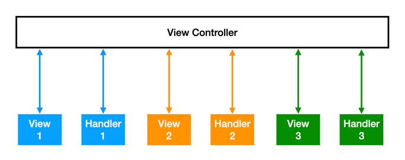
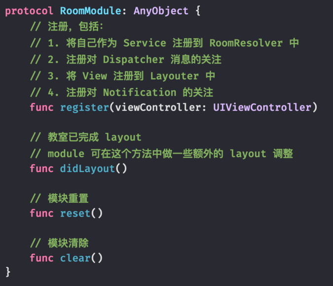
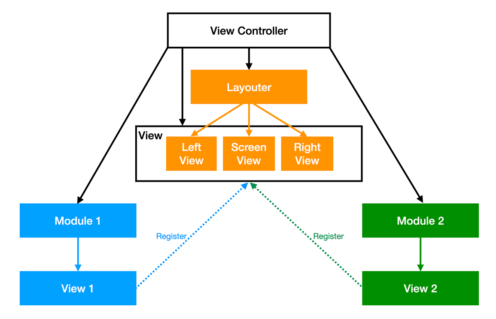
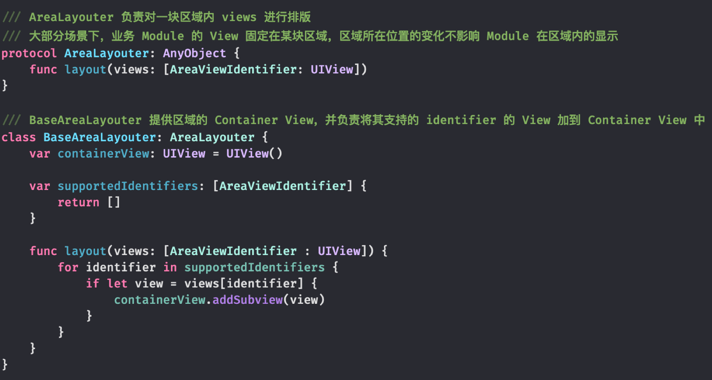
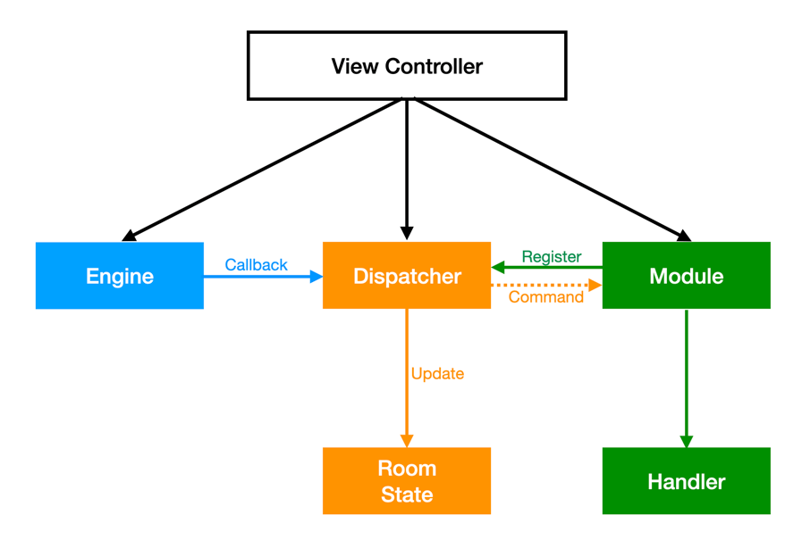
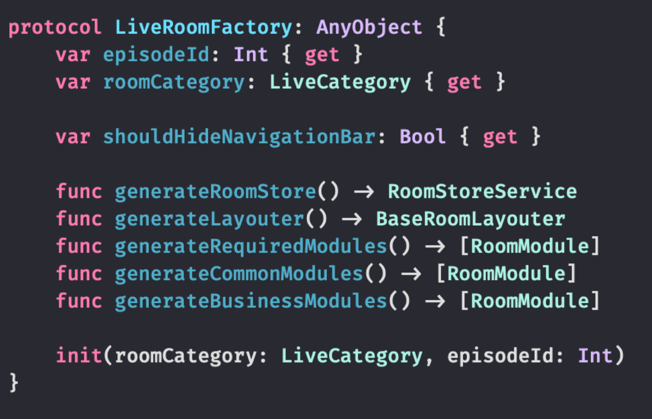

## 背景
猿辅导直播教室最早的业务形态，只有一种教室，在教室内增加各种课堂能力和活动，例如基础的课件渲染、板书笔迹等能力。在这样的业务需求下，整个教室对应一个 View Controller，教室内的每个业务模块使用 Handler（处理业务逻辑） + View（处理模块显示）的模式，教室 View Controller 是 Handler 和 View 的 Delegator，同时也接收直播引擎 SDK 的回调，调用 Handler 进行处理。

随着业务快速迭代，跨越 12 年不同年级和不同学科的教研要求千差万别，开始出现不同类型的新教室，当时因为各种因素为了”快“，实现新教室的方式是：拷贝教室代码后针对该类型教室进行定制。正如茨威格在《断头皇后》中写的，“她那时候还太年轻，不知道所有命运赠送的礼物，早已在暗中标注了价格”，欠下的技术债，使得直播教室的架构越来越影响开发效率和体验：
1. 教室 View Controller 越来越长，出现多个超过 5 千行以上代码的 View Controller，而且随着教室内课堂交互功能的增加，VC 的大小还会接着增长。
2. 多个教室大量重复的代码，一个在多教室使用的功能，需要加多次。如果需要修改，也要改多次。
3. 一个业务功能的代码不够聚合，散落在 View Controller 中多个地方，增删功能时容易遗漏，导致 Bug。
4. 如果要再新增教室类型，以上问题会越来越严重。

## 思路
经过对教室 View Controller 和业务模块进行梳理分析，发现：



* 业务模块 Handler 的 Delegate 都是 View Controller，由 View Controller 来更新 View 或者调度其他 Handler。
* 同时，View 的创建和层级也维护在 View Controller 中，View 事件 Delegate 给 View Controller 后交由 Handler 或者其他进行处理。
* 所有引擎 SDK 的消息也都统一回调给了 View Controller，由 View Controller 再传递给 Handler 处理。

由此可以看出，View Controller 由于承载的职责过多，里面充斥了各种胶水代码，是其长度过长的主要原因，同时，由于每个业务的 View 和 Handler 都需要和 View Controller 交互，耦合导致复用性下降，新增教室时只能通过拷贝代码的形式进行。总之，现有架构最核心的问题是：**View Controller 的职责太多，业务模块不够内聚**，解决了这些，上面的痛点就游刃而解。

解决思路就是：**教室积木化**：
* 构建教室像搭积木一样，每个业务模块像一块块积木，接口统一可拔插，能够灵活的根据业务要求进行组合，提高构建新教室的效率。
* View Controller 变成承载积木的容器，以及教室内资源和状态的持有者（因为生命周期一致），代码量和职责会变得很简单，不再有冗长的胶水代码。
* 业务模块内聚，自管理与其相关的 View、Model、Event，便于集成和拔插。模块间有通信机制和分层，不再通过 View Controller 实现 Delegate 来进行调度。
* 重构过程是渐进式的，对现有的 Handler 方式改动较小。
* 能够方便业务写单元测试。

为了更好的体现重构的效果，定下了一个可量化目标：
1. 教室 View Controller 代码行数**降到 500 行以下**。
2. 业务模块在多个教室复用时，**基本消除重复代码**。

## 方案
### 业务模块 Module
**核心点：新引入 Module 的概念，将业务模块的 View 和 Handler 原本在 View Controller 中的胶水代码抽离到 Module 中**


View Controller 目前会持有各个业务模块的 View 和 Handler，这些 View 和 Handler 的 Delegate 都是 View Controller，是 View Controller 中很大一部分的胶水代码，同时会在多个教室间重复，每次修改都需要在多个教室修改多遍。而引入 Module 后，Module 可以看成一个 Sub View Controller，负责持有 View 和 Handler，处理两者的 Delegate，将多个教室重复的代码整合进来，教室 View Controller 只负责创建并持有业务模块对应的 Module。

Module 作为教室积木化的基本单位，内聚一个业务的所有代码：
* 管理模块自身的业务逻辑和 View。
* 监听其关心的直播命令。
* 通过接口或其他方式进行模块间通信。

实现上，Module 就是一个 Protocol，定义了 Module 的生命周期方法：


### 模块间通信与依赖注入
**核心点：积木有缺口和凸起，模块也有依赖和消息，基于依赖注入 DI，两种类型均通过接口抽象，在模块初始化时根据不同教室需要，注入具体实现**

由于模块不再将消息 Delegate 给 View Controller 处理，模块与模块间需要通信，之前通信选用的方式有：直接使用通知、基于 OC Runtime 的 Mediator 方式、通过 Protocol 定义接口 + Register 注册实现的方式等，进过权衡，Protocol 定义接口这种方式更适合积木化重构的业务场景，在 Swift 语言特性的加持下，最终选用了 [Resolver](https://github.com/hmlongco/Resolver ) 这个 Swift 版本的依赖注入 Dependency Injection 框架，实现模块间通信：
* 每个 Module 供外部 Module 使用的接口，通过 Protocol 抽象成 Service，并通过 register 机制将 Service 注册。
* Module 使用其他 Module 的接口时，用 @Inject 的 Property Wrapper 定义一个 Service 类型的属性，通过 Service 调用接口。

```swift
// 模块 A 定义
protocol Service1 {
  func doSomething() {}
}

class ModuleA: Service1 {
  func doSomething() {
    // doing
  }
}

// 模块 B 使用模块 A
class ModuleB {
  @Inject var service1: Service1

  func handleSomething() {
    service1.doSomething()
  }
}
 
 
// 注册服务
Resolver.register { ModuleA() as Service1 }
```

依赖注入是一套很成熟的思想，在前后端项目上有广泛应用，积木化使用依赖注入之后：
* 不仅仅是平级的业务 Module，只要是 Module 需要，直播教室内各项功能都可以抽象成 Service 进行注入。
* 每个 Module 依赖的是 Service 接口，而不再是具体实现，由 DI 框架 Resolver 负责将真正的 Module 绑定到 Service 中，除了解耦外，在写单元测试时能够方便进行 Mock。

### 业务模块 View 管理：Layouter
**核心点：由于 View Controller 不再直接持有业务 View，因此 View 的层级关系、所处的区域需要从 View Controller 中抽离**

一开始的想法是由 Module 来管理，但是 Module 如果作为积木的一块，不应该对自己在教室的什么位置有假设，管理好自己 View 的状态就行，至于放到哪里应该是使用 Module 关心的。但是由 View Controller 管理的话，会导致多个教室间重复，也不够灵活。



因此， 引入 Layouter 的概念：
* Layouter 管理 View Controller 的 View，按照 UI 样式划分成多个区域，并创建和排版对应区域的 View
* Module 将 View 注册到 Layouter 中，Layouter 负责将 View 按照 Identity 和 Priority 安置在期望的区域，并安排好层级关系

实现上 Layouter 和 Module 一样，都是一个 Protocol，不同类型的教室布局实现各自具体的 Layouter，在 layout 方法中进行布局。


另外，有些区域内的排版在多个 Layouter 中是一样的，在 Layouter 的基础上引入 Area Layouter 的概念，负责一块区域的排版布局，例如课件区，Room Layouter 通过持有 Area Layouter 实现区域布局的复用。



### 教室状态持有者：Store
**核心点：业务模块不再通过 Delegate 拿教室内的通用数据，而是通过 Store 将通用数据传入**

各个业务模块经常通过 Delegate 从 View Controller 中获取例如 episodeId、teamId、userId、Episode 之类的数据，而这些数据可以理解是教室内的基础数据或状态，可以将这些数据整合到一个叫 Store 的模块中，通过依赖注入到 Module 中，这样就没必要再通过 Delegate 从 View Controller 中拿数据，省去一些胶水代码。


Store 也使用 Protocol 定义，不同类型教室实现具体的 Store，当一个 Module 在多个教室复用时，虽然 Store 可能实现不一样，但 Store Service 的接口是一致的，使得 Module 在多教室复用变得容易。

### 直播命令调度拆分：Dispatcher
**核心点：由业务模块主动注册其关心的直播命令，不再通过 View Controller 调度**

直播命令的回调不再通过 View Controller 调用，直接发送到业务模块上，一方面能从 View Controller 删除很多胶水代码，另一方面能明确一个模块关心的直播命令。



实现一个直播命令注册与转发的模块：Dispatcher
* 通过依赖注入到 Module 中，Module 使用 Dispatcher 显式声明自己需要的直播命令。
* 参考 RxSwift 的思想，通过注册 Block 的方式实现通知，相比 Notification 通知，这样引擎消息参数处理起来更安全和方便。
* Dispatcher 支持优先级，根据业务场景提供分发前、分发中、分发后三种队列。
* 对于复合命令，由 Dispatcher 进行拆分后分发给业务 Module，业务 Module 不需要再关心复合命令细节，对其无感知。

### 教室容器化
在上面的设计中，Module、Layouter、Store 都是 Protocol，为什么要用 Protocol 呢？这种面向接口编程带来的灵活性是为了能够将教室 View Controller 变成一个容器，不再关心里面到底有哪些模块，如何排版布局等，所有类型教室共用该容器 View Controller：


至于该往教室容器中传入具体哪些 Module，使用哪种 Layouter 和 Store，这些策略交由 RoomFactory 生成。Factory 也是一个 Protocol，不同策略实现不同具体的 Factory，符合 OCP 原则。


基于容器化教室和策略工厂的设计，业务上能够根据配置决定加载哪些 Module，从而进行功能灰度和回退，或者针对一个 Service，有 A、B 两个实现 Module，根据配置进行加载，进行 A/B Test，极大的提升了灵活性。

## 推进过程
完成了重构的方案设计后，如何推进重构方案的落地是一件比方案设计更有挑战性的事情，需要脚踏实地的一点点啃掉：
* 直播教室作为猿辅导的核心业务场景，一旦出问题直接影响用户核心体验，其稳定性要求高，如何保证重构方案能够比较平稳的落地？
* 业务还在不断迭代，开发人力一直比较紧张，如何协调资源？重构任务应该如何安排，才能即不影响需求迭代速度，又能及时完成，不在同步业务最新改动时耗费大量精力？

### 做好重构规划
首先，直播教室既有老师端又有学生端，确定先重构老师端再重构学生端的方向：
* 老师端是内部分发，用户也是内部老师，灰度范围、发 Fix 等更可控，风险要低一些。
* 老师端是纯 Swift 实现，也不需要考虑回放场景和回放教室，重构方案更容易落地。

之后，就要规划出关键路径，寻找并行点，让能够并行的任务尽量并行：
* 在完成重构方案设计后，开始实现基础定义，例如 Module、Layouter、Store 等定义，这些是关键路径，不完成的话会 Block 之后的工作。
* 基于上一步的基础数据结构，对一个业务模块进行积木化改造，验证重构方案的可用性，并积累积木化改造的方案。
* 完成一个模块之后，开始进人：Dispatcher 相对比较独立，可以交给一个同学负责；另外一个同学一起来对教室内相对基础和通用的模块进行积木化改造，为业务模块的改造提供前提。
* 当 Dispatcher、Layouter 和基础模块完成改造后，就开始对一个教室进行重构，好处是：
	* 一个教室完成改造后就能自测和初步提测，验证积木化整体流程的稳定性，提前暴露底层实现的重大问题。
	* 教室间 70% - 80% 的业务模块是复用的，改造完一个教室，其他教室的工作量就小很多。
	* 改造完的教室可以做为模板，方便其他教室进行改造时进行参考。
* 当完成了一个教室改造后，分工如下：
	* 一个同学负责自测后提测，并修复该教室一些严重问题。
	* 另一个负责实现模块的内存泄露检测工具，用于发现内存泄露问题。并编写积木化改造 101 文档，介绍对业务模块进行改造的方式和技巧。
* 基于积木化改造 101 文档和已经改造完成的教室，进更多的人，每个人负责一个教室，这样能在短时间完成所有教室的改造。

### 把握住关键时间节点
重构什么时候开始搞，需要把握住关键时间节点才能降低成本，使得收益最大化。判断什么时候最合适，需要通过不断深入到业务中，分析规律，多和 PM、运营聊天，了解他们下一步的规划，在线教育的业务特点和上课时间比较有规律性，把握规律后，在很少会有新教室类型的时间段内，努力抓住时间节点推进重构的进行。

### 重复并不是所有情况下都是坏的
为了保证重构完成后线上的稳定性，需要先进行小规模灰度，监控被灰度用户的各项指标，在出问题时能够及时回退到重构之前的版本。如何保证回退没有问题？那就是旧教室旧逻辑完全保留，如果涉及到修改，就拷贝一份再修改，通过重复来确定重构前的环境没有变化，这样保证回退时能够回退到“和以前一模一样”，当积木化重构在线上平稳后，再将旧代码一起全部删除。

我们看一下积木化重构后的成果，看是否满足最开始定下的可量化目标：
* 将多个 5000 行左右的 VC 合并为一个只有不到 300 行的容器 VC。
* 消除一个业务功能在多个教室间的重复。
* 新增教室复合 OCP 原则，不修改教室容器 VC，而是扩展 Factory。
* 一个教室增删模块只需要改一行代码。

## Beyond 技术
积木化整个重构过程，在技术之外还有很多感悟和收获，这里也想聊一聊：

### 关注人的因素
教室积木化是涉及到老师端、学生端核心业务场景的大重构，需要协调很多资源团队合作才能完成，那我们需要更关注人的因素，让参与进来的所有人都意识到重构不是炫技，不是开发瞎搞，而是件对大家都好的事情：
* 对于开发同学，积木化重构解决的是大家的长期以来的痛点，“天下苦秦久矣”，用重构的设计方案和大家多描述重构之后的样子，大家就有动力参与进来。同时，重构过程中有很多活都是脏活累活，一个人做的话很容易疲劳和烦躁，一点经验是多几个人，大家分一分，一个人头上没几个，也能感觉到团队作战的优势。
* 对于 PM 同学，在进行积木化重构方案设计时就不断同他们沟通，了解之后的长期迭代方向，并同步重构的作用是为了更好的支撑产品迭代，例如能够提供更灵活的配置与 A/B Test，例如能更快的增删模块，“给我一首歌的时间”就完成了。这样 PM 同学在需求排期上也愿意为重构协调时间。
* 对于测试同学，虽然重构需要教室全功能回测，工作量较大，但是同样的，重构之后，由于少了很多重复代码，不容易遗漏，交付质量也会有所提升，增删模块的提测时间会更早，同时，在提测过程中，也及时同步了为什么先提测一个教室，再整体提测，测试同学也能更认可。
* 对于上级 Leader，依次从能够更好支撑业务，提高代码质量，让开发同学写代码更开心等几个方面说明重构的意义，同时也提供了详细的设计文档和 Roadmap，于是 Leader 也认可这件事情，帮忙协调资源等。

总之，上面所有看起来像“影响力”的东西，都基于平时日积月累的“信任感”，做好每一个需求，认真对待交付质量和 Bug，多和 PM 沟通交流，与其他团队建立良好的关系，成为一个“靠谱”的工程师，这些东西终归在积木化重构上得到回报。

### 但行好事，莫问前程
直播教室由于业务方向上的不断快速迭代和探索，积累了大量技术债，导致无法通过简单重构解决，同时直播教室又是核心业务场景，对其进行大重构，风险不低，说心里话，是会害怕的，怕重构出故障，怕投入大量资源却没有完成。这时候需要的就是**勇气**，既然这件事经过判断是对的事情，能够为业务带来价值，同时也做好了设计和规划，就应该抛开其他想法，有勇气去把事情搞定。

有勇气开始后，设计出来重构方案时是激动的，但没有落地的方案都是“纸上谈兵”，而重构的落地过程是枯燥的，有很多脏活累活，有很多设计时没有想到的问题，没有捷径，只能“结硬寨，打呆仗”一点点解决，中间有想放弃的时刻，有很烦躁的时候，还是咬牙坚持了下来。

我是幸运的：iOS 团队的小伙伴们都很给力，大家一起努力把事情搞定。PM 和测试同学也非常支持，愿意协调排期。我的 Leader 全力支持，在业务压力较大的时候，协调了 Android 同学来写一些 iOS 需求，为积木化重构空出了 iOS 人力，也非常感谢 Android 同学的支援。

最终，有了勇气，有了坚持，再加上幸运，经过 2020Q4、2021Q1 两个 Q 的努力分别完成了老师端和学生端的教室积木化重构，所有的辛苦和投入在 2021Q2 得到了回报，这个 Q 上了 4 个新教室，证明之前判断的正确性，给自己带来极大的成就感和正反馈，难以想象如果没有经过积木化重构新增 4 个新教室的样子。

总之，但行好事，莫问前程。
